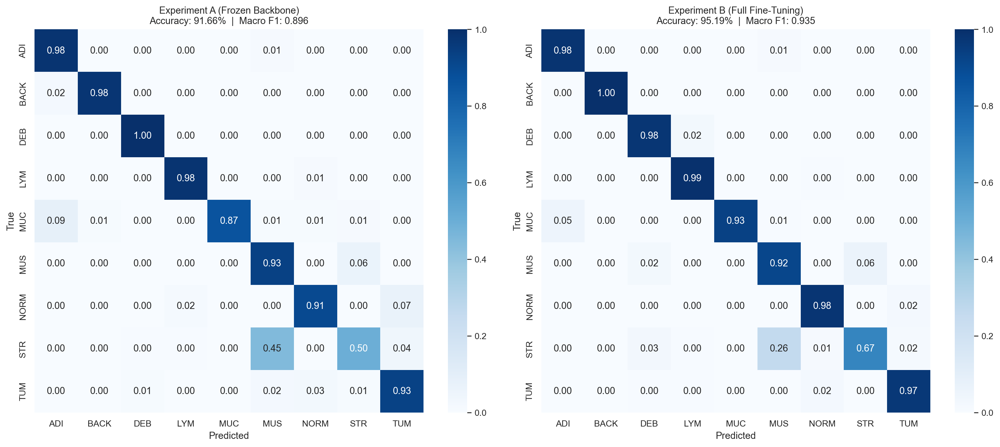
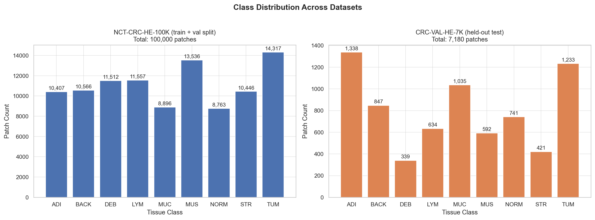
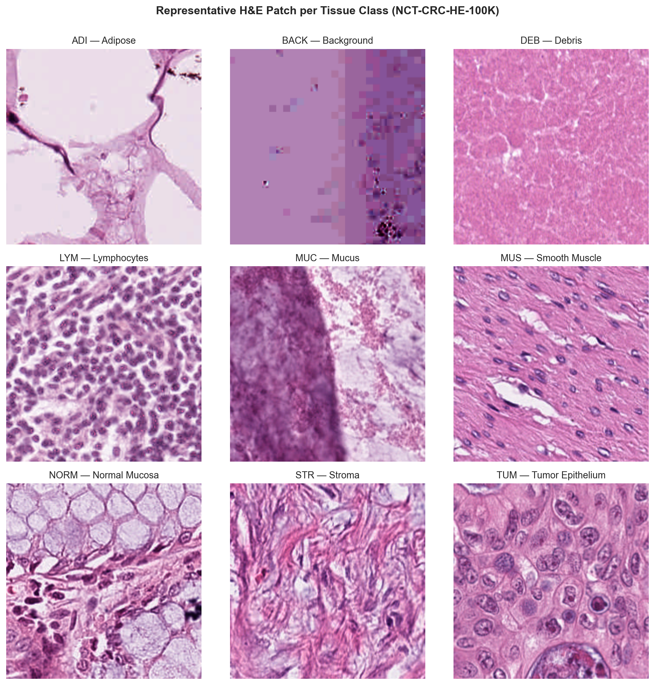
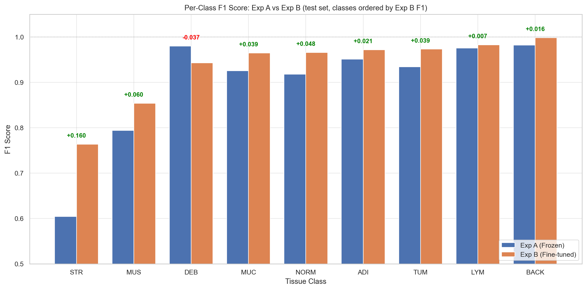
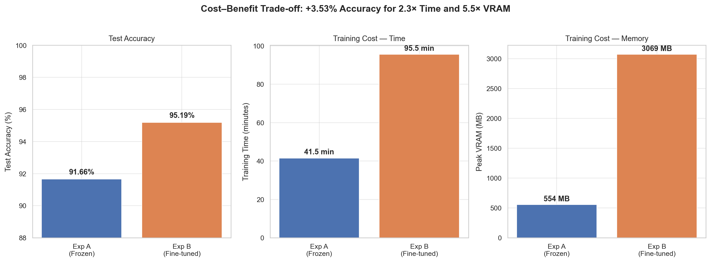

# Deep Learning-Based Tissue Classification in Colorectal Cancer Histopathology

Transfer learning with ResNet-50 for 9-class colorectal tissue classification on H&E-stained histopathology images, with systematic comparison of frozen feature extraction versus full fine-tuning.

**Course:** BIOE 486 — Applied Deep Learning for Biomedical Imaging, UIUC (Spring 2026)  
**Author:** Frank Lato

---

## Results

Fine-tuned ResNet-50 achieves **95.19% accuracy** (Macro F1 = 0.935) on the CRC-VAL-HE-7K external test set (n=7,180), surpassing the original dataset authors' VGG19 benchmark (94.3%) by 0.89 percentage points.

| Experiment | Strategy | Test Accuracy | Macro F1 | Weighted F1 |
|---|---|---|---|---|
| Kather et al. (2019) baseline | VGG19 (ImageNet pretrained, full fine-tuning) | 94.30% | — | — |
| Exp A | Frozen backbone, trainable head | 91.66% | 0.8961 | 0.9150 |
| Exp B | Full fine-tuning, differential LRs + cosine annealing | **95.19%** | **0.9353** | **0.9512** |



---

## Biological context

Accurate tissue phenotyping in colorectal cancer whole-slide images is a prerequisite for scalable oncology diagnostics. Quantifying the proportion of tumor epithelium, cancer-associated stroma, and immune infiltrates has direct prognostic relevance — the Tumor-Stroma Ratio (TSR) in particular is an emerging biomarker linked to patient survival. Manual pathologist review of gigapixel whole-slide images is time-consuming, subjective, and impossible to deploy at population scale. This project investigates whether transfer learning from natural image datasets can bridge the domain gap to H&E histopathology without requiring large annotated medical imaging cohorts.

---

## Dataset

**[NCT-CRC-HE-100K](https://zenodo.org/records/1214456)** (Kather et al., 2018) — 100,000 non-overlapping 224×224 H&E-stained patches from 86 whole-slide images, Macenko color-normalized, spanning 9 tissue classes.

**[CRC-VAL-HE-7K](https://zenodo.org/records/1214456)** — 7,180 patches from 50 patients with no overlap with the training set, used as the strictly held-out external test cohort.

**Tissue classes (9):** ADI (Adipose), BACK (Background), DEB (Debris), LYM (Lymphocytes), MUC (Mucus), MUS (Smooth Muscle), NORM (Normal Mucosa), STR (Cancer-Associated Stroma), TUM (Tumor Epithelium)




---

## Methodology

1. **Dataset preparation** — Custom PyTorch Dataset with standard normalization and augmentation (random flips, rotations ±10°, color jitter) to mitigate H&E staining variability across pathology laboratories
2. **Model architecture** — ResNet-50 initialized with ImageNet pretrained weights; original FC layer replaced with Dropout (p=0.5) and a 9-class linear projection head. ResNet-50 was selected over the VGG19 baseline for its 82% reduction in parameter count (~25M vs ~138M), directly reducing overfitting risk on limited medical cohorts
3. **Experiment A — Frozen feature extraction** — Backbone frozen; only the classification head trained with Adam (lr=1e-3)
4. **Experiment B — Full fine-tuning** — Entire network unfrozen with differential learning rates (backbone: lr=1e-5, head: lr=1e-4) and cosine annealing to prevent catastrophic forgetting while enabling domain-specific adaptation
5. **Evaluation** — Macro F1 used as the primary metric given class imbalance. All metrics computed exclusively on the held-out CRC-VAL-HE-7K test set

---

## Key findings

**Biological failure modes.** The dominant misclassification across both experiments was Cancer-Associated Stroma (STR) confused with Smooth Muscle (MUS). This is a biologically grounded error: both tissues are eosinophilic fibrous tissues with elongated spindle nuclei, presenting a genuine morphological challenge even for trained pathologists. The frozen backbone misclassified 45% of true STR samples as MUS. Full fine-tuning reduced this substantially, improving STR F1 by +0.160, as the network learned to distinguish disorganized stromal collagen fibers from the tightly packed parallel bundles of smooth muscle. Conversely, visually distinct classes like Adipose, Background, and Lymphocytes achieved near-perfect F1 scores under both strategies, confirming that generic ImageNet edge and texture detectors are already well-suited to these classes.



**Computational trade-offs.** The 3.53 percentage point accuracy gain from fine-tuning required a 2.3× increase in training time (41.5 min → 95.5 min) and a 5.5× increase in peak VRAM (554 MB → 3,069 MB). This trade-off is not uniform across applications: a frozen backbone is the more efficient engineering choice for pure tumor detection tasks, while full fine-tuning is justified where accurate stroma quantification is clinically meaningful, such as TSR computation for prognostic scoring.



**Domain gap.** Both models showed a 4.5–5.0 percentage point degradation from internal validation to external testing, reflecting class distribution shift between cohorts and partial overfitting to training cohort staining characteristics. This underscores why external validation is essential for assessing clinical readiness — internal validation alone is insufficient.

**Model interpretability.** Clinical deployment of this patch-level classifier would require integration of Grad-CAM saliency mapping to provide spatial interpretability alongside probability outputs, allowing pathologists to verify that predictions are driven by genuine morphological features rather than staining artifacts.

---

## Repository structure

```
ColorectalTissue_CNN/
├── src/
│   ├── config.py                       # Hyperparameters and paths
│   ├── crc_dataset.py                  # Custom PyTorch Dataset
│   ├── model.py                        # ResNet-50 with custom head
│   ├── train.py                        # Training loop
│   ├── evaluate.py                     # Evaluation, metrics, and plots
│   └── extract_training_history.py     # Pulls training curves from checkpoints
├── notebooks/
│   ├── 01_eda.ipynb                    # Exploratory data analysis
│   ├── 02_training.ipynb               # End-to-end training pipeline
│   └── 03_results.ipynb                # Results analysis and figures
├── outputs/
│   ├── figures/                        # Confusion matrices, learning curves, class samples
│   └── results/                        # Classification reports, history arrays
├── environment.yml                     # Conda environment spec
├── requirements.txt                    # Pip dependencies (PyTorch + libraries)
└── README.md
```


---

## Setup

```bash
git clone git@github.com:Frankthetank7277/ColorectalTissue_CNN.git
cd ColorectalTissue_CNN
conda env create -f environment.yml
conda activate bioe486
pip install -r requirements.txt
```

**GPU note:** `requirements.txt` pins `torch==2.5.1+cu121`. For a different CUDA version or CPU-only setup, install the appropriate PyTorch build from [pytorch.org](https://pytorch.org/get-started/previous-versions/) before running pip install.

---

## Data access

The NCT-CRC-HE-100K dataset (~15 GB) is not included in this repository. See [`data/README.md`](data/README.md) for download and setup instructions.

---

## Reproducing results

1. Download and set up the dataset per `data/README.md`
2. Open `notebooks/02_training.ipynb`
3. Run all cells to reproduce both experiments end-to-end
4. Checkpoints save to `outputs/checkpoints/`; figures and reports save to `outputs/figures/` and `outputs/results/`

Training both experiments takes approximately 2 hours 16 minutes on a single NVIDIA GPU.

---

## References

1. Kather et al. "Predicting survival from colorectal cancer histology slides using deep learning." *PLOS Medicine*, 2019.
2. Schirris et al. "NCT-CRC-HE: Not All Histopathological Datasets Are Equally Useful." *arXiv*, 2024.
3. He et al. "Deep residual learning for image recognition." *CVPR*, 2016.

---

## Author

Frank Lato · MS Bioengineering & Imaging Computing, UIUC  
[LinkedIn](https://www.linkedin.com/in/franklato/)
